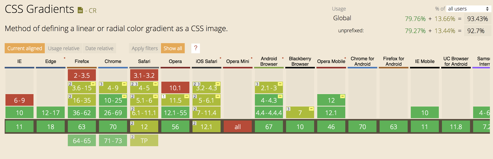

# CSS Gradient

## 前言

1. 渐变适用性：

   ```
   <image> = <url> | <cross-fade()> | <gradient>
   <gradient> =
     <linear-gradient()> | <repeating-linear-gradient()> |
     <radial-gradient()> | <repeating-radial-gradient()>
   
   ```

   `<image>` 可以用在包括：border-image-source, background-image, list-style-image, cursor 等属性上。即可以在以上属性中设置渐变。

2. 渐变区域：渐变本身无尺寸，渐变区域与实际关联的DOM尺寸有关。如设定background-image的渐变色，则渐变区域默认为DOM的padding-box，若使用background-size指定背景尺寸的话，渐变区域则为指定的尺寸。

3. 降级兼容处理：background-image覆盖于background-color之上，故对于不支持渐变的浏览器，可设置一个纯色的背景色。


## 线性渐变

语法：

```
linear-gradient() = linear-gradient(
  [ <angle> | to <side-or-corner> ]? ,
  <color-stop-list>
)
<side-or-corner> = [left | right] || [top | bottom]
<color-stop-list> = <color-stop>#{2,}
<color-stop> = <color> <length-percentage>?
```

第一个参数指明了颜色渐变的方向：

- 可以是角度，比如0deg，表示**正上方向**，90deg表示向右（顺时针）
- 也可以是关键词，比如to top, to right, to bottom, to left, 分别对应了0deg, 90deg, 180deg, 270deg。当然也可以不指定，默认值是to bottom(从上到下)

第二个参数指明了颜色断点（即[color-stop](https://drafts.csswg.org/css-images-3/#color-stop)）。位置可以省略，第一个默认为0%，最后一个默认为100%，如果中间的值没有指定，则按颜色数目求均值。

> 注意:
>
> -webkit-前缀的线性渐变使用的角度坐标系与旋转(rotate)角度坐标系相同


## 径向渐变

径向渐变其实就是颜色从一个点以同心圆或者椭圆向外渐变。

语法：

```
radial-gradient() = radial-gradient(
  [ <ending-shape> || <size> ]? [ at <position> ]? ,
  <color-stop-list>
)
```

- position用来指定渐变圆心的位置，默认为center，[赋值规则](https://drafts.csswg.org/css-backgrounds-3/#position)与background-positon的类似；
- ending-shape可以是circle或者elipse，如果省略，则默认值与size相关，size指定一个值就是圆形，否则是椭圆；
- size可以是具体的值，也可以用关键字指定，默认值是farthest-corner。如果是具体值，圆形需要一个数值，椭圆需要两个。关键字则包括：
  - closest-side 指渐变区域某一边到盒子中心最近的距离；
  - farthest-side 指渐变区域某一边到盒子中心最远的距离；
  - closest-corner 指渐变区域某一顶点到盒子中心最近的距离；
  - farthest-corner 指渐变区域某一顶点到盒子中心最远的距离；
- color-stop-list与linear-gradient类似

>  注意：
>
> - size的数值不能是负数
> - W3C规范规定，百分比的数值只能用于椭圆，不能用于圆形。
> - position的值可以是负数


## 重复渐变

重复渐变可细分为重复线性渐变(repeating-linear-gradient)与重复径向渐变(repeating-radial-gradient)。

重复的规则简单说就是用最后一个颜色断点的位置减去第一个颜色断点位置的距离作为区间长度，不断的重复。比如repeating-linear-gradient(red 10px, blue 50px) 就相当于linear-gradient(…, red -30px, blue 10px, red 10px, blue 50px, red 50px, blue 90px, …)


### 小例子：使用径向渐变模拟圆形边框

[径向渐变小例子](https://codepen.io/anon/pen/WYqYaQ)


### 兼容性




##### 参考链接

1. [CSS Images Module Level 3(ED,7 November 2018)](https://drafts.csswg.org/css-images-3/#image-values)
2. [CSS Gradient详解 | AlloyTeam](http://www.alloyteam.com/2016/03/css-gradient/)
3. [深入理解CSS3 gradient斜向线性渐变](https://www.zhangxinxu.com/wordpress/2013/09/%E6%B7%B1%E5%85%A5%E7%90%86%E8%A7%A3css3-gradient%E6%96%9C%E5%90%91%E7%BA%BF%E6%80%A7%E6%B8%90%E5%8F%98/)