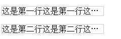
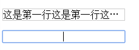

# 每周分享(2016.12.16)

## jQuery事件的命名空间

### 场景: 如何方便快捷地对绑定的事件进行选择性解绑

​	当对某一元素多次绑定了某种事件时(比如click事件)，若想解绑单个事件回调，是很不方便的。

### 解决方法: jQuery事件提供了命名空间的概念，可方便定位已绑定的事件

​	jQuery可对绑定是事件增加命名空间，在解绑时可根据命名空间来查找，更加方便快捷地对事件进行解绑。

```javascript
// 假定如下5个事件回调
$('#element').on('click', function(e) {
  // 事件回调1
}).on('click.eleNameSpace', function(e) {
  // 事件回调2
});

$('#other').on('click.eleNameSpace', function(e) {
  // 事件回调3
}).on('dblclick.eleNameSpace', function(e) {
  // 事件回调4
}).on('self.otherName', function(e) {
  // 事件回调5
});

// 以下每一行语句均独立执行，即以下语句是不连贯的
$('#element').off('click');	// 事件回调1，2被解绑
$('#element').off('click.eleNameSpace'); // 事件回调2被解绑
$('#other').off('.eleNameSpace'); // 事件回调3，4被解绑
$('#other').off('.otherName');	// 事件回调5被解绑
```


## text-overflow与contenteditable的冲突

### 场景: 对加了H5可编辑属性contenteditable的某元素设置单行溢出出现省略号的css样式

```html
<p class="test">这是第一行这是第一行这是第一行这是第一行</p>
<p class="test" contenteditable>这是第二行这是第二行这是第二行这是第二行</p>
```

```css
.test {
  width: 200px;
  overflow: hidden;
  word-break: nowrap;
  text-overflow: ellipsis;
  border: 1px solid #ccc;
}
```

初始:



对第二行进行编辑增加内容后:



### 解决方法: 无有效解决方法，应主动避免省略号样式与可编辑属性的同时使用