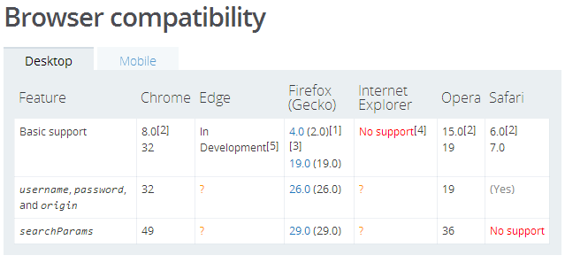
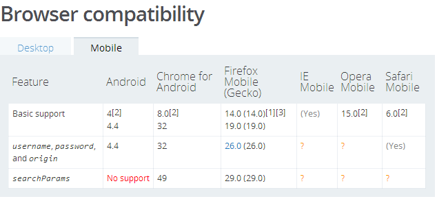

# 每周分享(2017.01.06)

## 场景: 根据url查询串的不同参数，需要作出不同反应，为了知道有哪些参数，需要进行解析查询串

本次讨论的url查询串是指key值唯一，val值为字符串的简单查询串，解析的结果为一个包含所有key和val键值对的对象。

## 解决方法: 使用正则方法解析url中的查询串

### 正则: `/(([^?&=]+)(?:=([^?&=]*))*)/g`

#### 解释：

1. key和val的正则

   为了简单起见，我们假设 `name` 和 `value` 可以为除了 `?`, `=`, `&` 之外的任意字符。那么它们的正则就可以表示为：`/[^?&=]+/`

2. key=val的正则

   根据实际情况，参数对可能存在以下多种形式：

   - `param=value`
   - `param=`
   - `param`

   这部分的正则构造出来就是这个样子：`/[^?&=]+(=[^?&=]*)*/`，为了方便后面对 `key` 和 `val` 进行提取，我们将其进行分组: `/(([^?&=]+)(=([^?&=]*))*)/`

3. 修改完善

   `/(([^?&=]+)(=([^?&=]*))*)/`中有4个分组，第一个分组为key=val的分组，第二个分组为key，第三个分组为=val，第四个分组为val，由于=val这种形式我们并不关系，所以可以不对其进行分组，使用正则?:，即`/(([^?&=]+)(?:=([^?&=]*))*)/`

   由于一个查询串有多个key=val用&分隔，所以我们需要全局搜索:`/(([^?&=]+)(?:=([^?&=]*))*)/g`

   即最后得出的正则就是: `/(([^?&=]+)(?:=([^?&=]*))*)/g`

#### 使用：

```javascript
var str = location.search; // 假设为?a=1&b=2&c=3&d=4
var reg = /(([^?&=]+)(?:=([^?&=]*))*)/g;
var query = {}; // 存储解析结果的对象
str.replace(reg, function(match, $1, $2, $3) {
  // match为匹配到的结果，
  // $1为分组1，即key=val形式，
  // $2为分组2，即key，
  // $3为分组3，即val
  query[$2] = $3; // 储存解析结果
  return $1;
});
console.log(query); // {a:1,b:2,c:3,d:4}
```

## 其他方法:

### 字符串方法

由于查询串由&分隔key=val参数对，key和val由=分隔

```javascript
var str = location.search; // 假设为?a=1&b=2&c=3&d=4
var query = {};
str = str.replace('?', '');
str.split('&').forEach(function(item) {
  var key = item.split('=')[0];
  var val = item.split('=')[1];
  query[key] = val;
});
console.log(query); // {a:1,b:2,c:3,d:4}
```

### URL与URL的searchParams属性

可直接使用URL创建url的实例

```javascript
var url = location.href; // 假设查询串为?a=1&b=2&c=3&d=4
var urlObj = new URL(url);
var query = {};
urlObj.searchParams.forEach(function(v,k){
  query[k] = v;
});
console.log(query); // {a:1,b:2,c:3,d:4}
```

此方式兼容性较差，详见[MDN文档](https://developer.mozilla.org/en-US/docs/Web/API/URL)

searchParams属性的支持情况：



