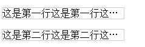
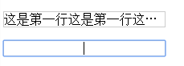

## text-overflow与contenteditable的冲突

### 场景: 对加了H5可编辑属性contenteditable的某元素设置单行溢出出现省略号的css样式

```html
<p class="test">这是第一行这是第一行这是第一行这是第一行</p>
<p class="test" contenteditable>这是第二行这是第二行这是第二行这是第二行</p>
```

```css
.test {
  width: 200px;
  overflow: hidden;
  word-break: nowrap;
  text-overflow: ellipsis;
  border: 1px solid #ccc;
}
```

初始:



对第二行进行编辑增加内容后:



### 解决方法: 无有效解决方法，应主动避免省略号样式与可编辑属性的同时使用