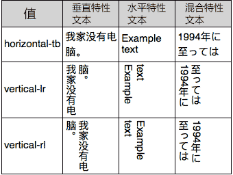
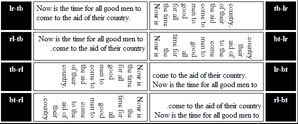

## 文字竖直排列

注：本文章参考了张鑫旭的一篇博客http://www.zhangxinxu.com/wordpress/2016/04/css-writing-mode/，如有版权问题，请联系本人邮箱：673944632@qq.com

#### 使用br换行标签实现文字换行

```html
<div>
  文<br>字<br>竖<br>直<br>排<br>列
</div>
```

#### 强制设置显示区域的宽度

```html
<style> 
  div { 
  	width: 10px; 
  	font-size: 10px; 
  } 
</style> 
<div>
  文字竖直排列
</div>
```

#### 使用writing-mode属性

```html
<style>
  div {
    writing-mode: tb-rl;
   	-webkit-writing-mode: vertical-rl;    
  }
</style>
<div>
  文字竖直排列
</div>
```

writing-mode语法比较特别,因为最开始只有IE浏览器支持这个属性，后来才被各大现代浏览器实现，所以writing-mode有两套语法，一套是IE私有属性，一套是CSS3规范属性

附：兼容性图


CSS3：

```html
/* 关键字值 */
writing-mode: horizontal-tb;//水平方向自上而下的书写方式
writing-mode: vertical-rl;//垂直方向自右而左的书写方式
writing-mode: vertical-lr;//垂直方向自左而右的书写方式
```

表现对照：



IE：

```htm
-ms-writing-mode: lr-tb | rl-tb | tb-rl | bt-rl | tb-lr | bt-lr | lr-bt | rl-bt | lr | rl | tb
```

表现对照：



ie下的属性共有11个那么多，但是如果需要兼容ie7以上的话需要记住lr-tb(左-右，上-下)，tb-rl(上-下，右-左)，分别对应于css3的horizontal-tb和vertical-rl，如果需要兼容ie8以上的话只需再多记住一个tb-lr(上-下，左-右),对应于css3的vertical-lr。归纳起来，我们一共需要记住以下6个属性

```html
writing-mode: lr-tb (IE7+) | tb-rl (IE7+) | tb-lr (IE8+);
writing-mode: horizontal-tb | vertical-rl | vertical-lr;
```

#### writing-mode还能做什么？

##### 1.改变margin重叠方向

writing-mode将元素默认的水平流改成了垂直流。在盒模型中，垂直方向的距离由margin决定。属于同一个BFC的两个相邻Box的margin会发生叠加。换句话说，在默认的水平流中，上下相邻的两个元素垂直方向上的margin会重叠。但是在writing-mode将元素变成垂直流之后，反而左右相邻的两个元素水平方向上的margin会重叠。

```html
.box {
    width: 400px;
    background-color: #f0f3f9;
    overflow: hidden;
}
.list {
    margin: 20px;
    background-color: #cd0000;
    color: #fff;    
}
.verticle-mode {
    writing-mode: tb-rl;
    -webkit-writing-mode: vertical-rl;      
    writing-mode: vertical-rl;
}
<p><strong>默认流-垂直margin重叠</strong></p>
<div class="box">
    <div class="list">margin:20px;</div>
    <div class="list">margin:20px;</div>
</div>

<p><strong>垂直流-水平margin重叠</strong></p>
<div class="box verticle-mode">
    <div class="list">margin:20px;</div>
    <div class="list">margin:20px;</div>
</div>
```

##### 2.使用margin:auto实现垂直居中

```html
.box {
    width: 400px; height: 300px;
    background-color: #f0f3f9;
    overflow: hidden;
	border: 1px solid;
}
.auto {
    margin-top: auto;
    margin-bottom: auto;
	width: 200px;
	height: 200px;
	background-color: #ccc;
}

.verticle-mode {
    writing-mode: tb-rl;
    -webkit-writing-mode: vertical-rl;      
    writing-mode: vertical-rl;
}
<p><strong>默认流-margin-top:auto;margin-bottom:auto不居中</strong></p>
<div class="box">
  <div class="auto"></div>
</div>

<p><strong>垂直流-margin-top:auto;margin-bottom:auto垂直居中</strong></p>
<div class="box verticle-mode">
  <div class="auto"></div>
</div>
```

##### 3.使用text-align:center实现垂直居中

```html
.box {
    width: 400px; height: 300px;
    background-color: #f0f3f9;
    text-align: center;
	border: 1px solid;
}

.verticle-mode {
    writing-mode: tb-rl;
    -webkit-writing-mode: vertical-rl;      
    writing-mode: vertical-rl;
    *writing-mode: tb-rl;
}

.auto {
  	width: 200px;
	height: 200px;
	background-color: #ccc;
	display: inline-block;
}
<strong>默认流-text-align:center水平居中</strong>
<div class="box">
  <div class="auto"></div>
</div>

<strong>垂直流-text-align:center垂直居中</strong>
<div class="box verticle-mode">
   <div class="auto"></div>
</div>
```

##### 4.使用text-indent实现文字下沉效果

```html
.btn {
    display: block;
    color: #a78252;
    background-color: #ddc390;
    width: 85px; height: 85px;
    line-height: 85px;
    border: 6px solid #ddc390;
    border-radius: 50%;
    box-shadow: inset 0 0 0 1px #d6b681, 0 1px, 0 2px, 0 3px, 0 4px;
    text-align: center;
    -webkit-transition: border-color .25s, background-color .25s;
    transition: border-color .25s, background-color .25s;    
    font-size: 42px;
    cursor: pointer;
	text-decoration: none;
}

.btn:active {
    text-indent: 2px;
}

.verticle-mode {
    writing-mode: tb-rl;
    -webkit-writing-mode: vertical-rl;      
    writing-mode: vertical-rl;
    *writing-mode: tb-rl;
}
<a href="javascript:" class="btn verticle-mode">领</a>
```

