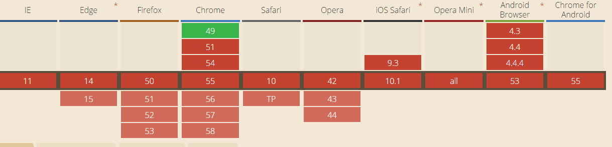

bind、call、apply

apply、call用法与区别

在 javascript 中，call() 和 apply() 都是为了改变某个函数运行时函数体内部 this 的指向。

call()和apply()作用相同，唯一区别是接收的参数不同，apply()接收两个参数，第一个参数是运行函数的作用域，另一个是参数数组，如：

    var numbers = [1,2,3];
    Math.max.apply(this,numbers);  //3

call()接收两个参数，第一个参数与apply()一样都是运行函数的作用域，其余参数必须逐一列举出来，如:

    Math.max.call(this,1,2,3);  //3

因为call()和apply()可以改变函数体内this的指向，因此当我们希望在函数实例的一个方法中调用一个新对象但又不想重新定义这个方法时可以这样做:

    function Person() {
      this.name = '程序员';
    }
    Person.prototype = {
      say: function () {
        console.log('我是'+this.name);
      }
    }
    var man = new Person();
    test = {
      name: "产品经理"
    }
    man.say.apply(test);  //我是产品经理
    man.say.call(test);	//我是产品经理
    /**say方法原来的作用域并没有改变，只是在调用apply()、call()方法时才改变**/
    man.say();	//我是程序员

当函数的参数不确定时，也可以使用call()、apply()，如:

    function max () {
    	return Math.max.apply(this,arguments);
    }
    max(1,2,3)	//3

bind

bind()与call()、apply()用法相似，也可以改变函数体内的this指向，但bind()会创建一个新的函数。当调用bind()时会以传入bind()的第一个参数作为this,如：

    var func = function () {
      return this.x;
    }
    var obj = {
      x: 1
    }
    var test = func.bind(obj);
    test();	//1

当多次调用bind()时，this指向的是第一个bind()传入的第一个参数，如：

    var func = function () {
      return this.x;
    }
    var obj1 = {
      x: 1
    }
    var obj2 = {
      x: 2
    }
    var obj3 = {
      x: 3
    }
    var test = func.bind(obj1).bind(obj2).bind(obj3);
    test();	//1

原因在于bind()的实现相当于在函数内部包了一个call()/apply()，第二次bind()相当于再包住第一次的bind()，所以第二次以后的bind()是无法生效的。

附上bind()对浏览器支持情况：

