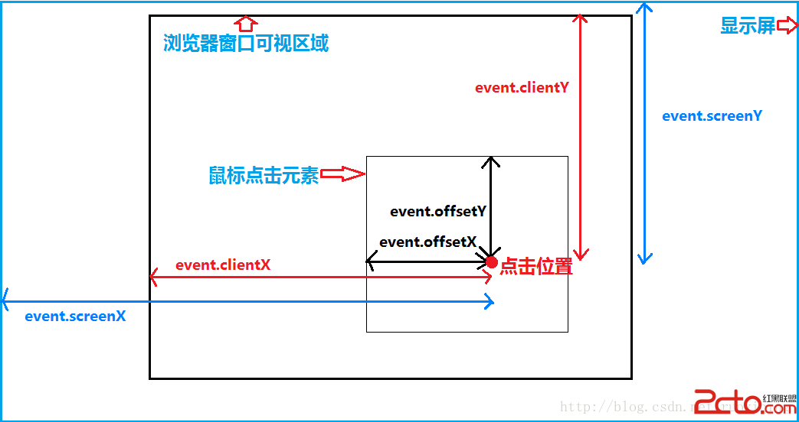

# 坐标系

常用：event.clientX，event.screenX，event.pageX

## event.clientX, event.clientY

相对于浏览器可视区域，与滚动条无关（窗口坐标）

## event.screenX, event.screenY

相对于计算机屏幕，与滚动条无关

## event.pageX, event.pageY

相对于整个html文档

## event.offsetX, event.offsetY

相对于事件源元素 (srcElement) 的 X 坐标，以元素盒子模型的 **内容区域** 的左上角为参考点

## event.layerX, event.layerY

相对于当前坐标系的位置，即如果触发元素没有一个position定位布局，以页面为参考点，如果有，将改变参考坐标系，从触发元素盒子模型的 **border区域** 的左上角为参考点



## document.elementFromPoint

返回当前文档上处于指定坐标位置最顶层的DOM元素，坐标是相对于包含该文档的浏览器窗口的左上角为原点来计算的, 通常 x 和 y 坐标都应为正数。

```js
var dom = document.elementFromPoint(x, y) // x 和 y 是坐标数值, 不需要单位
console.log(dom)
```
