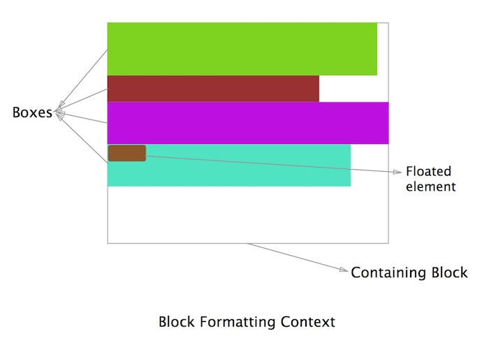
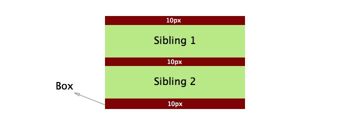
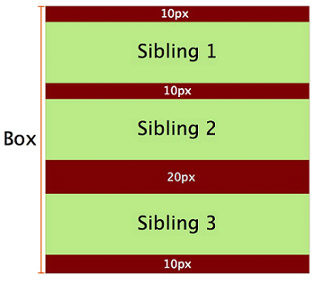
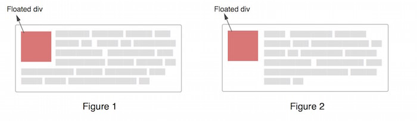
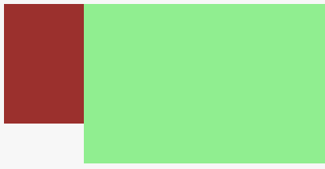
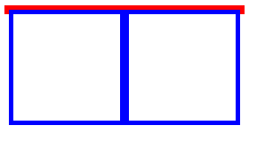
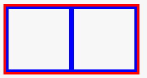

# BFC — 浏览器的渲染模式之一


#### BFC —— block formatting context(块级格式上下文),独立的布局环境;

是浏览器的一种渲染方式，决定着如何渲染容器和容器内的元素（还有IFC,GFC,FFC等）

**理解：** 块级：块级盒子； 上下文：创建该BFC的元素的所有子元素 

​            块级盒子创建出BFC**独立**的布局环境，规定该盒子中所有子元素的布局，特别是浮动(clear)和定位（float);

​	   BFC中创建新的BFC，新的BFC不受外部影响；

### **1.出现以下的场景** ，css会为它创建新的BFC。

1. 浮动元素(`float!:none;` )和绝对定位元素(`position:absolute / fixed;` );
2. 行内的块级元素`display:inline-block`;
3. 表格单元格：`table-cells`, 表格标题` table-captions` ;
4. 弹性盒子flex boxes : `display:flex / inline-flex` ;
5. `overflow:auto/ scroll /hidden`(不能是visible);

具备以上5点的其一的**块级元素**，都可以触发创建BFC


### 2.具备的特性

1. 内部的BOX，在垂直方向上，由顶部到底部放置；垂直方向上的距离由margin决定；
2. 内部的BOX，在水平方向上，每个元素的`margin-box`的**左边** 和包含块的`border-box`的**左边** 相接触(左边和右边看格式)，即使存在**浮动**也是这样；

3. BFC的区域不会与float box叠加
4. BFC就是页面上的一个隔离的**独立**容器，容器里面的子元素不会影响到外面的元素，反之亦然。
5. 计算BFC的高度时，**浮动元素也参与计算**



### 3.应用和解决方法

1. magin折叠的问题

   - BFC会导致**内部相邻的box的外边距折叠** ——特性1的垂直距离特性

     html代码：

     ```html
     <div class="container">
         <p>Sibling 1</p>
         <p>Sibling 2</p>
     </div>
     ```

     css代码：

     ```css
     .container {
           background-color: red;
           overflow: hidden; //建立BFC
       }
       p {
           background-color: lightgreen;
           margin-top: 10px;
           margin-bottom: 10px;
           height:50px;
       }
     ```

     效果：

   - 解决

     - 给内部的box加具备条件之一，触发BFC——对应特性4

       html代码：

       ```html
       <div class="container">
           <p>Sibling 1</p>
           <p>Sibling 2</p>
         <div class="newBFC">
           <p>Sibling 3</p>
         </div>
       </div>
       ```

       css代码，添加以下代码：

       ```css
       .newBFC {
           overflow: hidden;//建立新的BFC
         } 
       ```

       改进效果：

       

     - [示例代码：外边距折叠](http://jsbin.com/gefetih/edit?html,css,output)


2. 布局(文字环绕)

   - 浮动元素和非浮动元素都靠左对齐——对应特性2

     

   - 解决

     - 给内部不浮动的box加具备条件之一，触发BFC——对应特性4

       html代码：

       ```html
       <div class="aside"></div>
       <div class="main"></div>
       ```

       css代码:

       ```css
       .aside {
         width: 100px;
         height: 150px;
         float: left;
         background: #9b302d;
            
       }
       .main {
         height: 200px;
         background: lightgreen;
         /*改进 创建BFC*/
         overflow:hidden;
       }
       ```

       改进效果图：

       

     ​

     - [示例2: 文字环绕](http://jsbin.com/jataxi/edit?html,css,output)

       ​


3. 清除浮动
   - 由于内部元素浮动，导致父元素高度为0

     

     解决

     - 给内部的box加具备条件之一，触发BFC——对应特性5，计算高度包括浮动元素
     - 清除浮动只能清除**同一块格式化上下文中** 在它**前面** 的元素的浮动

     html代码：

     ```html
       <div class="BFC">
         <div class="box"></div>
         <div class="box"></div>
       </div>
     ```

     css代码：

     ```css
     .BFC {
       border: 5px solid #f00;
       width: 260px;
       /*添加改进*/
       overflow: hidden;
     }
     .box {
       border:5px solid blue;
       width:120px;
       height: 120px;
       float: left;
     }
     ```

     效果图：

     

     ​

     [示例3：清除浮动](http://jsbin.com/coyezo/edit?html,css,output)


