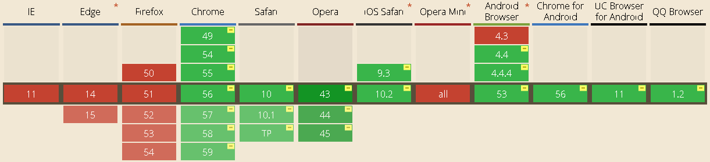
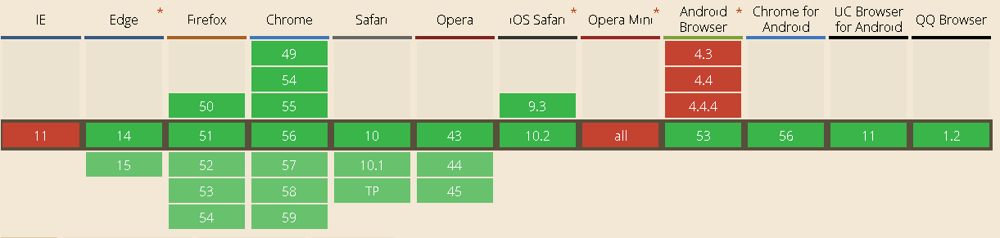

# image

设备像素比(devicePixelRatio)理解

[http://www.html-js.com/article/Mobile-terminal-H5-mobile-terminal-HD-multi-screen-adaptation-scheme%203041](http://www.html-js.com/article/Mobile-terminal-H5-mobile-terminal-HD-multi-screen-adaptation-scheme%203041)

[http://www.zhangxinxu.com/wordpress/2012/08/window-devicepixelratio/](http://www.zhangxinxu.com/wordpress/2012/08/window-devicepixelratio/)

### image-set

- **根据用户设备的分辨率匹配合适的图像**

- 举例

  ```css
   // 支持2种写法: image-set( <url> | <string> )
  background-image: image-set(url(girl.jpg) 1x, url(girl1.jpg) 2x);

  background-image: image-set("girl.jpg" 1x, "girl1.jpg" 2x);
  ```

- image-set和background-size

- [image-set兼容性](http://caniuse.com/#search=image-set)

  

  ​

### img标签属性 srcset，sizes

#### srcset

 	该属性允许我们可以提供 一系列也许可以被浏览器使用的图片资源。我们提供一个以逗号为分割的图片list，浏览器会自动匹配最佳显示图片（userAgent根据设备特性匹配）


需要提供

- 图片文件的路径
- 图片文件的 **像素宽度**(即图片实际分辨率的宽度)

```html


// sizes不支持用百分比计算
```

#### sizes

​	该属性明确定义了图片在 **不同的媒体条件**下应该显示的尺寸，**在`srcset`中使用了宽度(w)，我们才能随之设置`sizes`属性**

- **注意** sizes只能刚打开页面时浏览器识别屏幕宽度，并且将图片加入缓存，不能像媒体查询一样，实时改变，要改变只能清除缓存，重新打开。

#### 二者共同决定了图片显示

[srcset兼容性](http://caniuse.com/#search=srcset)




参考demo：[srcset与sizes新释义w描述符示意demo](http://www.zhangxinxu.com/study/201410/srcset-sizes.html)

文章参考:[响应式图片srcset全新释义sizes属性w描述符](http://www.zhangxinxu.com/wordpress/2014/10/responsive-images-srcset-size-w-descriptor/)

