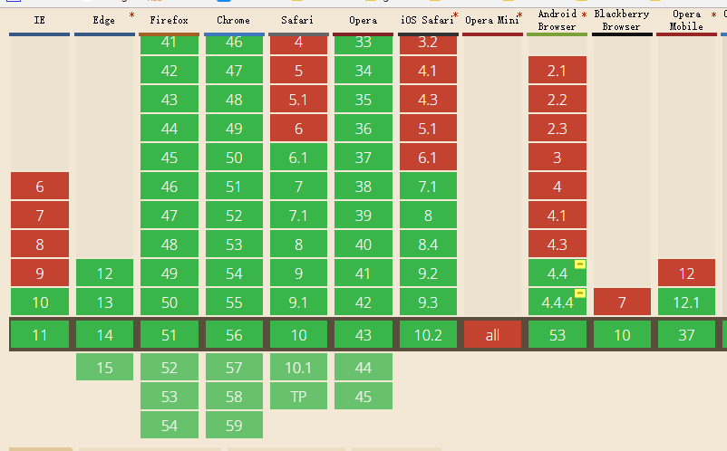

### HTML5 Page Visibility API

#### 场景：

​   在浏览器里面，如果 **页面最小化了** 或者 **隐藏在了其他标签页后面** ，那么有些功能是可以停下来的，比如轮询服务器或者某些动画效果。

#### 描述：

​   **页面可见性**。这个 API 本身非常简单，由以下三部分组成。

#### 组成：

- **document.hidden**：表示页面是否隐藏的布尔值。页面隐藏包括 **页面在后台标签页中** 或者 **浏览器最小化** （注意，页面被其他软件遮盖并不算隐藏，比如打开的 sublime 遮住了浏览器）

- **document.visibilityState**：表示下面 4 个可能状态的值 (出现的频率比较高是hidden和visible)

    - hidden：页面在后台标签页中或者浏览器最小化
    - visible：页面在前台标签页中
    - prerender：页面在屏幕外执行预渲染处理. (很少使用 )
    - unloaded：页面正在从内存中卸载. (很少使用 )

- **visibilitychange** 事件：当文档从**可见变为不可见**或者**从不可见变为可见**时，会触发该事件。

  ​

#### 兼容情况：

**IE10+, IOS 6+ , Android4.4+** 兼容良好(ps: ~~Android 4.4和4.4.4要加私有前缀~~, 我用我手机(android 4.4.4)测,也可以不用前缀)     

#### 例子：

​   [Page Visibility](./example/HTML5-Page-Visibility.html)