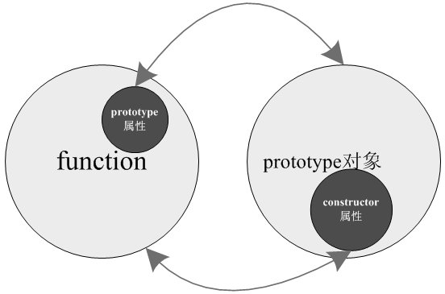
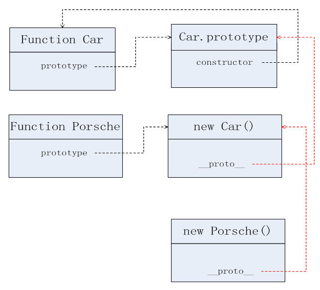

**先给一个例子：**

```javascript
var car;
(function(){
    function Car (name) {
        this.name = name;
    }

    Car.prototype.getName= function () {
        console.log(this.name);
    };
    car = new Car('Porsche');
})();

//在外面
//我们还想给Car增加方法，该怎么加？
```


**下面主角登场：**

### JS中constructor属性


可以这样写：

```javascript
car.constructor.prototype.add = function () {
	console.log(this);  // this 的指向？？？
};
```


简介：

​	**constructor 属性返回对创建此对象的构造函数的引用** 

​         默认指向`prototype`对象所在的构造函数。

```javascript
function P() {}

P.prototype.constructor === P // true
```

 

由于`constructor`属性定义在`prototype`对象上面，意味着可以被所有实例对象继承。

```javascript
function P() {}
var p = new P();

p.constructor
// function P() {}

p.constructor === P.prototype.constructor
// true

p.hasOwnProperty('constructor') // 本身并没有的constructor这个属性
// false
```


上面代码中，`p`是构造函数`P`的实例对象，但是`p`自身没有`contructor`属性，该属性其实是读取原型链上面的`P.prototype.constructor`属性。


 


有了`constructor`属性，就可以从实例新建另一个实例。

```javascript
function Constr() {}
var x = new Constr();

var y = new x.constructor();//平时很少用这种方法
y instanceof Constr // true 
```


用法：这使得在实例方法中，调用自身的构造函数成为可能。

```javascript
Constr.prototype.createCopy = function () {
  return new this.constructor();
};
```

继承:

```javascript
function Super() {}

function Sub() {
  Sub.superclass.constructor.call(this);
}

Sub.superclass = new Super();
```


上面代码中，`Super`和`Sub`都是构造函数，在`Sub`内部的`this`上调用`Super`，就会形成`Sub`继承`Super`的效果。


再来看看

```javascript
function Person(name,age){
	this.name = name;
	this.age = age;
}
Person.prototype = {
	getName:function(){
		return this.name;
},
	getAge:function(){
		return this.age;
	}
};
var p = new Person("Nicholas",18);
console.log(p.constructor); //Object()
console.log(p.getAge()); //18
console.log(p.getName()); //Nicholas
```


```javascript
//再来看看一个例子

function Car() {}

function Porsche() {}
Porsche.prototype = new Car();

var porsche = new Porsche();
console.log(porsche.constructor);  //[Function: Car]
```


 


例子中porsche在自身查不到`constructor`属性，去原型中查找，Porsche.prototype也不存在，则沿着原型链继续向上，查到**Car.prototype**，存在constructor属性，此constructor属性指向了Car。所以需要手工修正


```javascript
function Car() {}

function Porsche() {}
Porsche.prototype = new Car();
Porsche.prototype.constructor = Porsche;  //手工修正constructor的指向
var porsche = new Porsche();
console.log(porsche.constructor);  //[Function: Porsche]
```


```javascript
// 避免这种写法
C.prototype = {
  method1: function (...) { ... },
  // ...
};

// 较好的写法
C.prototype = {
  constructor: C,
  method1: function (...) { ... },
  // ...
};

// 好的写法
C.prototype.method1 = function (...) { ... };
                                      
//补充使用 $.extend
function A(){};
                                      
$.extend(A.prototype,{
  add: function(){
    
  },
  ...//其它方法
})                                      
```


补充·

f.constructor.name：实例得到构造函数的名称

```javascript
function Foo() {}
var f = new Foo();
f.constructor.name // "Foo"
```
链接：

http://www.yehbeats.com/2016/06/15/js-constructor/

http://javascript.ruanyifeng.com/oop/prototype.html