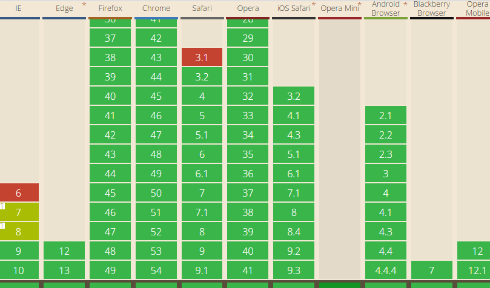
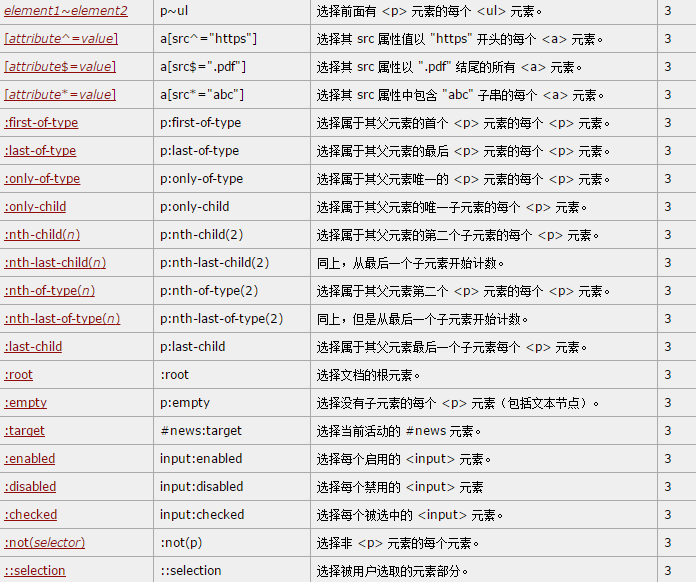

### css 选择器部分讲解

**后代选择器**的简单认识

**先来个例子轻松一下：**

```css
.red { color: red; }
.green { color: green; }
```

```html
<div class="red">
	<div class="green">
		<p>1. 颜色是？</p>
    </div>
 </div>
<div class="green">
	<div class="red">
		<p>2. 颜色是？</p>
	</div>
</div>
```

demo：http://jsbin.com/qinivovexi


解答：DOM越深的类名权重越高

但是如果我是后代选择器呢？

```css
.red p { color: red; }
.green p { color: green; }
```

```html
<div class="red">
	<div class="green">
		<p>1. 颜色是？</p>
    </div>
 </div>
<div class="green">
	<div class="red">
		<p>2. 颜色是？</p>
	</div>
</div>
```


demo：http://jsbin.com/jugoniyato

后代选择器情形，祖先选择器对应DOM无论多深多浅都是同一级别的，而最终起作用的是选择器声明在CSS样式中的顺序，即优先显示后面的CSS声明。


额外补充：

```css
:not(.green)  p { color: red; }
.green p { color: green; }
```

```html
<div class="red">
	<div class="green">
		<p>1. 颜色是？</p>
    </div>
 </div>
<div class="green">
	<div class="red">
		<p>2. 颜色是？</p>
	</div>
</div>
```

demo:http://jsbin.com/kovabogoxu


#### CSS3选择器:nth-child和:nth-of-type之间的差异

:nth-child和:nth-of-type都是CSS3中的伪类选择器

nth-child: 选中于其父元素的第 N 个子元素，不论元素的类型

:nth-of-type 选中父元素的特定类型的第 N 个子元素的每个元素

##### **例子**

还是不懂？？？ 直接看例子

```html
<section>
    <p>我是第1个p标签</p>
    <p>我是第2个p标签</p>  <!-- 希望这个变红 -->
</section>
```


```css
p:nth-child(2) { color: red; }
p:nth-of-type(2) { color: red; }  // 效果一样
```

demo: http://jsbin.com/roxolelize

没有差异吗？？？ 请接着往下看

```html
<section>
    <div>我是一个普通的div标签</div>
    <p>我是第1个p标签</p>
    <p>我是第2个p标签</p>  <!-- 希望这个变红 -->
</section>
```

```css
p:nth-child(2) { color: red; }
p:nth-of-type(2) { color: red; }
```

demo:http://output.jsbin.com/gucoxerufi

如果你下面写这样写

```
<section>
    <div>我是一个普通的div标签</div>
    <span>我是一个普通的span标签</span>
    <p>我是第1个p标签</p>
    <p>我是第2个p标签</p>  <!-- 希望这个变红 -->
</section>
```


`p:nth-child(2)`将不会选择任何元素。

而`p:nth-of-type(2)`表示父标签下的第二个`p`元素，显然，无论在`div`标签后面再插入个`span`标签，还是`h1`标签，都是第二个`p`标签中的文字变红

ps（刚刚测试一下，nth-of-type()针对的是标签，写类名会有问题）


##### 兼容情况：  

**兼容良好**：ie8+ ，其它基本都兼容


**附录css3选择器**



ps 注意:not括号里面没有‘引号’


补充： 绑定this指向；

```javascript
var obj ={
	a:function(){
      $('selector').on('click', this.b);// this 指向obj
	},
	b:function(){
	   //这里的this指向?   (分两种情况说明)
	}

}

```


### **bind(this)** 

它和apply，call的区别？？？

**还有其他答案？求指教**

