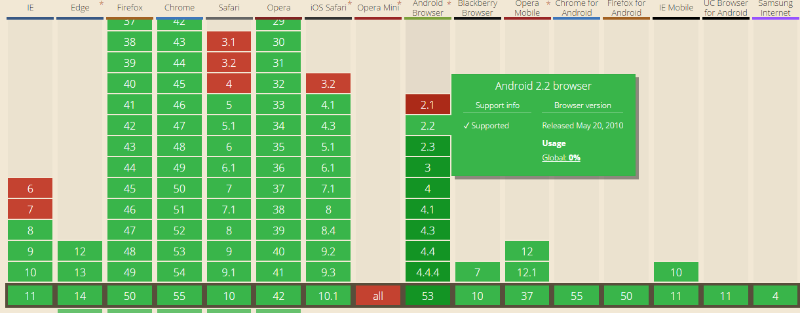

### onhashchange 事件

##### 简介：

​	在当前页面URL中的hash值(锚点)发生改变时触发

##### 语法：

```javascript
window.onhashchange = func    ;           // func 为函数引用
```

##### 例子：

```javascript
window.onhashchange = function(e){
  console.log(e);
  alert('我被触发了');
}

```

你可以通过设置[Location 对象](http://www.runoob.com/jsref/obj-location.html) 的 [location.hash](http://www.runoob.com/jsref/prop-loc-hash.html) 或 [location.href](http://www.runoob.com/jsref/prop-loc-href.html) 属性修改锚部分

`hashchange` 事件对象有下面两个属性

  ](kk_image.png)

##### 事件对象：

](hashchangEvent.png)


**参数解读**：

**bubbles**:  事件属性返回一个布尔值，如果事件是冒泡类型，则返回 true，否则返回 fasle。

**cancelable: **  事件属性返回一个布尔值。如果用 preventDefault() 方法可以取消与元素关联的默认动作(如a的链接url)，则为 true，否则为 fasle。

**cancelBubble (true)**的作用跟stopPropagation是一样的．都是用来阻止浏览器默认的事件冒泡行为．
他们的不同之处是:stopPropagation符合W3C标准．适用于FireFox等浏览器，不支持IE.而cancelBubble方法不符合W3C的标准．且只支持IE浏览器;

**composed**: 暂时查不到资料。。。

**defaultPrevented**：返回指定的 event 对象上是否调用了 preventDefault() 方法，返回布尔值

**eventPhase**: 返回事件传播的当前阶段（1,2,3） 

它的值有三个'，它们分别表示捕获阶段(1)、正常事件派发(2)和起泡阶段(3)。


**isTrusted**:  返回一个布尔值,表明当前事件是否是由用户行为触发

**path**:  数组; 返回当前触发事件的dom对象 一直到window对象(以数组形式)；

**returnValue**： event.preventDefault()方法是用于取消事件的默认行为，但此方法并不被ie支持，在ie下需要用window.event.returnValue = false; 来实现。

补充：

return false  我们在平时的编码中javascript中经常会用到[return false;]语句来阻止事件的向上传递，其实[return false;]语句包含了2层意思：

1. 阻止触发事件的元素的默认动作（比如说一个link(<a href="[http://www/baidu.com">>)，它的默认动作就是迁移到baidu首页）
2. 阻止触发事件的元素向上传递事件(stopPropagation等)

**target ，srcElement，currentTarget** 

IE下,event对象有srcElement属性,但是没有target属性;Firefox下,event对象有target属性,但是没有srcElement属性.但他们的作用是相当的，即：

firefox 下的 event.target = IE 下的 event.srcElement

target发生在事件流的目标阶段，而currentTarget发生在事件流的整个阶段（捕获、目标和冒泡阶段）


timeStamp 事件属性可返回一个时间戳。指示发生事件的日期和时间（从 epoch 开始的毫秒数）。

epoch 是一个事件参考点。在这里，它是客户机启动的时间。（IE 浏览器不支持）


##### 兼容情况：

**良好（ie8+ ，ios5+ android2.2+）**

 


相关链接：

https://developer.mozilla.org/zh-CN/docs/Web/Events/hashchange


