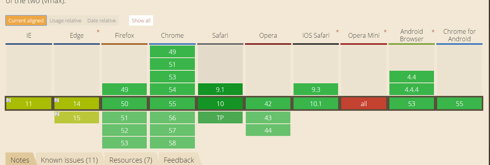
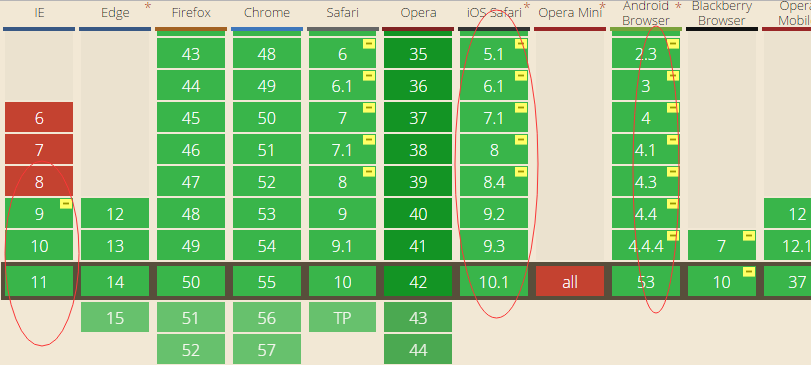

### vh, vw, vmin,vmax

#### 简介：

   	css3引入的”vw”和”vh”基于宽度/高度相对于视窗大小，”vw”=”view width”, “vh”=”view height”; 以上我们称为视窗单位允许我们更接近浏览器窗口来定义大小。视窗宽度是100vw; 视窗高度是100vh; “视区”所指为浏览器内部的可视区域大小 即window.innerWidth/window.innerHeight大小,不包含任务栏标题栏以及底部工具栏的浏览器区域大小。

​	vmin 和 vmax则关于视口高度和宽度两者的最小或者最大值。例如：浏览器的宽度设置为1100px，高度设置为700px， 1vmin = 7px， 1vmax = 11px。如果宽度设置为800px,高度设置为1080px, 1vmin就等于8px, 1vmax则为10.8px。

#### 能解决什么呢：

1.画出宽和高自适应相等的正方形或圆

 例子： http://output.jsbin.com/weroxapuva

```css
div {
  width:30%;
  height:30vw;
  background:green;
  text-align:center;
}
```


 **兼容情况**：Android 4.4+  ios 6+


**其他解决方法**：平时画圆或正方形是**垂直方向的padding撑开容器** 或者设置width 等于height;

```css
.placeholder {
  width: 20%;
  padding-bottom: 20%;
  background:green;
  height: 0; /*防止填充内容后会出现问题*/
}

```

例子：http://output.jsbin.com/dikayitopa 


相关介绍链接：

http://www.cocoachina.com/webapp/20150807/12940.html

http://www.zhangxinxu.com/wordpress/2012/09/new-viewport-relative-units-vw-vh-vm-vmin/


### 垂直居中：Css3下 absolute 布局上下文垂直居中


利用css3 translateX(-50%) translateY(-50%); 把left：50%；top：50%的内容器移到正中心，因为 translateX(-50%)是相对于自身的width的一半， translateY(-50%);相对与自身的height的一半，**这种方法内外容器都可以是不定的**。

```css
#example5 {
    width: 400px;
    height: 100px;
    background: #161616;
    color: #fff;
    position: relative;
}
#example5 .inner{
    position: absolute;
    left: 50%;
    top: 50%;
    background: #999;
    transform: translateX(-50%) translateY(-50%);
}

<div id="example5">
    <div class="inner">块区域垂直居中</div>
</div>
```

演示链接：

http://output.jsbin.com/vurapesicu


2D Transform 兼容情况：ie9以上，ios，anroid 兼容良好

 


其他垂直居中方法： **演示链接**：http://output.jsbin.com/fenecalobo

**方法一 利用 `line-height` 实现垂直居中(最简便)**

```css
略
```


**方法二 利用 `display: table` 实现垂直居中（内联元素）**

```css
#example2 {
    height: 100px;
    background: #161616;
    color: #fff;
    width: 400px;
    overflow: hidden;
    display: table;
}
#example2 .inner{
    display: table-cell;
    vertical-align: middle;
    height: 50px;
    background:#999;
}

<div id="example2">
    <div class="inner">块区域垂直居中</div>
</div>
```


**方法三 利用margin：auto 居中（兼容性好）**

```css


<!-- margin auto居中 -->
  <style>
    #expample6 {
      width: 400px;
      height: 100px;
      background: #eee;
      position: relative;
    }
  
    #expample6 .inner {
      position: absolute;
      top: 0;
      bottom: 0;
      left: 0;
      right: 0;
      margin: auto;
      height: 50px;
      width: 70%;
      background: #aaa;
      color:#222;
      text-align: center;
    }
  </style>

  <div id="expample6">
      <div class="inner">Content here</div>
  </div>
```


**方法四 经典 absolute 布局上下文垂直居中**

```css
#example4 {
    width: 400px;
    height: 100px;
    background: #161616;
    color: #fff;
    position: relative;
}
#example4 .inner{
    height: 50px;
    width: 200px;
    position: absolute;
    left: 50%;
    top: 50%;
    margin-top: -25px;
    margin-left: -100px;
    background:#999;
}

<div id="example4">
    <div class="inner">块区域垂直居中</div>
</div>
```


**方法五 利用 Flex布局 居中（补充：兼容性差 ie10+ andriod 4.4+  ios 7+）**

```css
#expample7 {
    width: 400px;
    height: 100px;
    background: #eee;
    display: flex;
    justify-content: center;
    align-items: center;
}

#expample7 .inner {
    height: 50px;
    width: 70%;
    background: #aaa;
    color:#222;
}

<div id="expample7">
    <div class="inner">Content here</div>
</div>
```
相关链接：

https://my.oschina.net/wangch5453/blog/800398