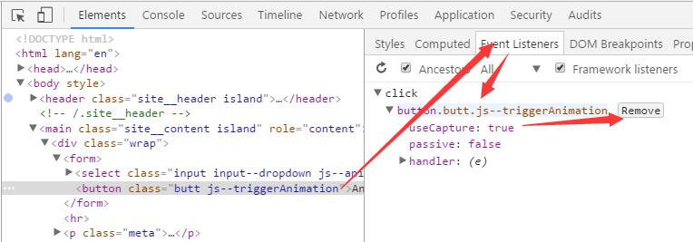
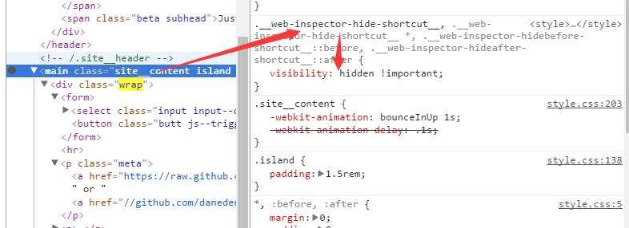
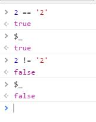

# 每周分享(2017.01.06)

### Chrome Dev Tools 开发者工具使用技巧

#### Element 元素

1. Event Listener 事件监听器

   作用：监听当前DOM元素绑定的事件

   具体： `userCapture` 表示事件是否向上冒泡，点击 `remove` 能移除当前DOM元素绑定的该事件

   

2. `ctrl + f` 快速查找定位DOM元素

   作用：在DOM中快速查找，当前匹配的地方高亮显示，搜索框显示检索到的总数量和当前高亮在总数量中所处的位置

   

3. 选择当前DOM元素，然后按下h，隐藏当前DOM元素

   作用：为当前DOM元素设置css样式：`visability: hidden !important;` ，从而隐藏元素。再次按下 `h` 移除该css样式

   

4. Break on 用于监听DOM节点的变化

   作用：右键当前DOM元素，选择`break on`，勾选需要监听的变化（树结构改变、属性改变、节点移除），帮助我们监控和定位操作元素的代码

   具体：`break on` 有三个选项，分别是：`Subtree Modifications(树结构改变)`，`Attributes Modifications(属性改变)`， `Node Removal(节点移除)`，表示在不同模式下触发监听。开发者工具会直接`断点`，跳转到发生这些变化的代码位置。

   ​

   

   

   ​

#### Console 控制台

1. console.log

   最实用也是最常用的调试信息打印方法

2. console.table 打印数组对象

   在打印数组对象时有特效的调试信息打印方法

   如下数组对象：

   ```javascript
   var arr = [
     {firstName: 'lee',lastName: 'first'},
     {firstName: 'zhao',lastName: 'two'},
     {firstName: 'qian',lastName: 'three'}
   ];
   ```

   before: 使用`console.log()`

   

   now: 使用`console.table()`,数组对象信息相比使用`console.log()`更加清晰明了

   

3. `$_ ` 打印返回最后执行命令的结果

   

4. `keys()` 打印对象的key，`values()` 打印对象的values


如下对象：调用`keys(obj)` 和调用 `values(obj)` 返回对象的键组成的数组和键值组成的数组

``` javascript
var obj = {a:'123',b:'456',c:'789',d: function(){console.log(1)}};
```


