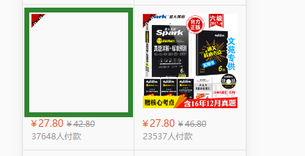
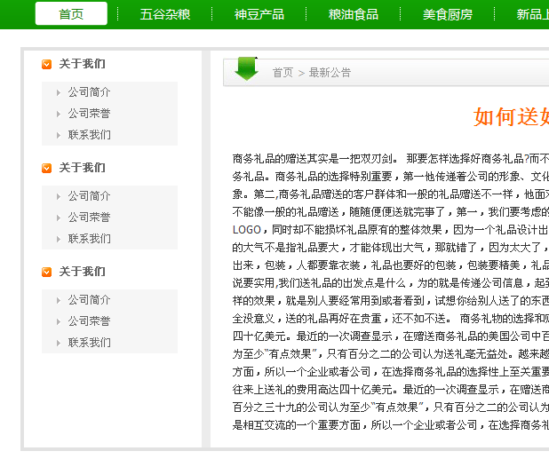

# 正方形（特定比例形状）

当**margin/padding**取形式为百分比的值时，无论是**left/right**，还是**top/bottom**，都是以父元素的width为参照物的！

## 应用场景



## 1.

```html
<div class="container-1">
</div>

.container-1 {
  width: 10%;
  padding-bottom: 10%;
  border: 1px solid red;
}
```

  
## 2.

```html
<div class="container-2">
</div>

.container-2 {
  width: 10%;
  border: 1px solid yellow;
}
.container-2:after {
  content: "";
  display: block;
  margin-top: 100%;
}
```


# 多列等高

首先把列的**padding-bottom**设为一个足够大的值，再把列的**margin-bottom**设一个与前面的**padding-bottom**的正值相抵消的负值，父容器设置超出隐藏，这样子父容器的高度就还是它里面的列没有设定**padding-bottom**时的高度，当它里面的任一列高度增加了，则父容器的高度被撑到它里面最高那列的高度，其他比这列矮的列则会用它们的**padding-bottom**来补偿这部分高度差。因为背景是可以用在padding占用的空间里的，而且边框也是跟随padding变化的，所以就成功的完成了一个障眼法。

## 应用场景



```html
<div class="container-3">
  <div class="left">Lorem ipsum dolor sit amet, consectetur adipisicing elit. Tenetur obcaecati a numquam, autem laudantium, illum ut provident asperiores harum tempore.</div>
  <div class="main"></div>
  <div class="right"></div>
</div>

.container-3 {
  border: 1px solid blue;
  overflow: hidden;
}
.left,
.main,
.right {
  margin-bottom: -10000px;
  padding-bottom: 10000px;
}
.left {
  float: left;
  background: #2cc;
  width: 300px;
}
.main {
  background: #900;
  width: 300px;
  margin-left: 300px;
}
.right {
  margin-left: 600px;
  background: #ccc;
}
```